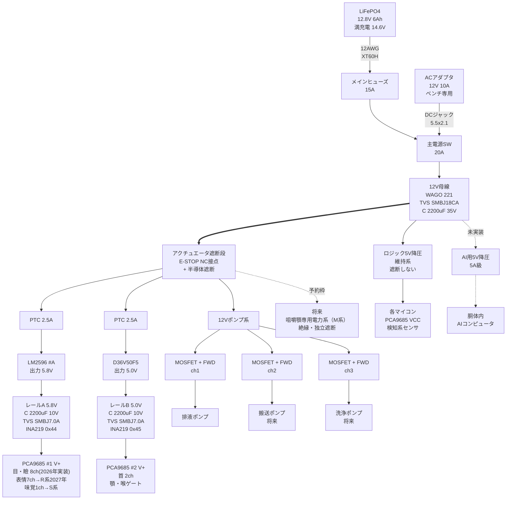
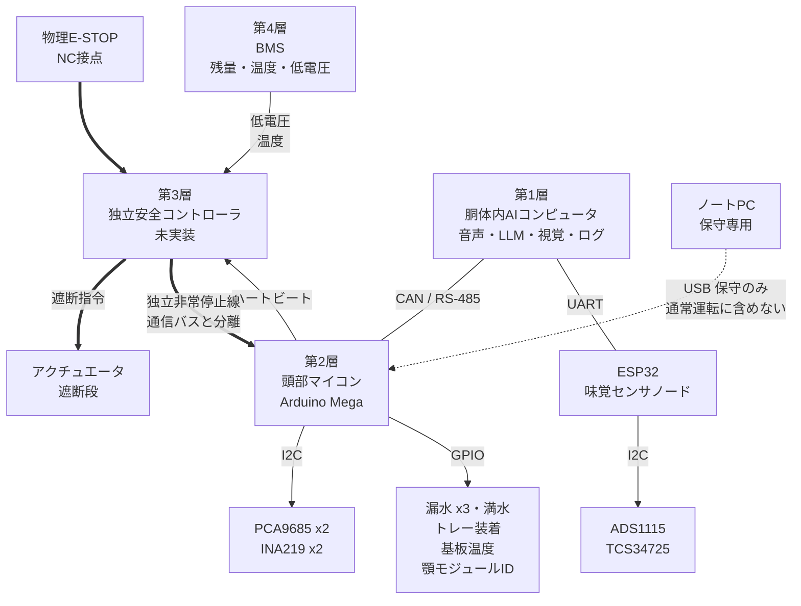

# 電源系統図（頭部／スケール100%）— S系

版数: v1.3
改訂日: 2026-08-06
準拠文書: 器創造計画 2026-2033（改訂基準日 2026-08-03）
系統タグ: S（安全・制御・知覚。R系へ再利用可能な記述とする）
変更履歴:
- v1 2026-08-04 旧H-Phase体系文書（`docs/archive/2026-08-03_power_system_hphase.md` v1.1）をS系文書として再構成。
  - **レールAの負荷モデルを2026年実装範囲へ修正（§2図1・§5・§6.1）。**旧文書の「表情・目・瞼／12ch使用」はL系（目2軸・瞼2軸＝4ch）とR系（upperLip・cheek×2・eyebrow×2・forehead×2＝7ch、決定2により2027年R5-R9）が同居しており、系統分離の原則（§0）に反していた。レールAの2026年電力予算を4chのみへ修正し、R系7chは「2027年R5着手時に追加、現時点は電力予算に含めない」と明記した。
  - **稼働時間計算の測定点誤りを修正（§6.2）。**旧値「76.8Wh ÷（12.8V×1.6A）≒3.7時間」は電池側12.8Vの電流としてレールA側のピーク電流1.6Aを誤用していた。全負荷を電池側等価電力へ変換し、かつレールAを2026年実装範囲（4ch）で再計算した結果、定常運転で実用約6.1時間、全軸同時ピークを継続した場合の下限値として約1.8時間と算出した。
  - **プリチャージ抵抗の要否を再判定（§7-2）。**突入電流292A・110µsに対するBMS過電流保護閾値・応答時間、および主電源SW（20A定格）の接点溶着リスクが未確認であることを明記した。100Ω/2Wのプリチャージ抵抗が部品表に在庫済みであることを踏まえ、「未使用」の暫定結論を「使用する」方針へ変更し、バイパス接点付き回路と時定数（τ=220ms）を示した。詳細な検証項目は `docs/OPEN_ISSUES.md` へ登録する。
  - E-STOP後の残留エネルギーとその放電経路を明記。専用の放電（ブリーダ）経路が存在しないことを設計不備として `docs/OPEN_ISSUES.md` へ登録した（§7-3）。
  - 12V母線の逆接保護について対策候補を2案提示（§7-4）。
  - PTCの諸元（RXEF250相当）と保護協調の未整理事項を整理し `docs/OPEN_ISSUES.md` へ登録した（§7-5）。
  - **参照一覧のデータシート出典を一次情報（TI／Pololu／Littelfuse）で確認し、URLと取得日を記入した。**
  - E-STOP検証：全アクチュエータ給電経路が遮断段（CUT）を通ることを図1上で確認し、迂回経路が無いことを明記した（§3）。
  - 旧文書のH-Phase参照を新体系（S/M系）へ置換した。
  - §5のforehead軸表記の綴り誤り（forhead→forehead）を修正。R系は白紙CADの新規設計であり、InMoov公式パーツ名の誤字を踏襲する理由がないため。
  - **目の軸数の誤りを修正（重要）。**一次情報 `inmoov.fr/eyes-i2/`（取得日2026-08-04）により、目は眼球4軸＋瞼4軸＝計8軸（左右独立、ソフトウェア同期）と判明した。レールAの2026年実装範囲を4ch→8chへ修正し、§6.1・§6.2を再計算した（定常約6.1時間→約4.7時間）。経緯は `docs/decisions/2026-08-04_eye_axis_count_correction.md` を参照。

対象: InMoov首・i2Head＋口内モジュール＋味覚ノード

採用スケール: 100%（旧H-Phase体系での確定経緯は `docs/archive/2026-08-03_servo_comparison_hphase.md` を参照。H-Phase体系自体は廃止済みだが、決定の経緯記録として旧文書名を残す）

---

## 0. 設計方針

1. **通常運転にノートPCとインターネットを含めない。** USB接続は開発・更新・ログ回収に限定する
2. **安全停止はAI・OS・通信バスから独立させる。** LLMに安全判断を委ねない
3. **アクチュエータ電源は遮断でき、ロジック電源は安全側で維持する。** 筋肉を殺し、頭を生かす
4. **GNDは全系統共通、＋側はレールで分離する**
5. 電源ソースはベンチ=ACアダプタ、自律=LiFePO4。**同時接続禁止**（v1は物理的排他運用）

## 1. 制御四層と電源の対応

| 層 | 実体 | 電源 | 故障時の原則 |
|---|---|---|---|
| 第1層 AIコンピュータ | 胴体内（Raspberry Pi 5 / Jetson級・未選定） | 12V→5V/5A級 ※未実装 | 安全停止を妨げず再起動。クラウド無しで最低限継続 |
| 第2層 頭部リアルタイムマイコン | Arduino Mega | 5V-LOGIC（維持系） | 通信断で新規動作禁止、中立または力解放 |
| 第3層 独立安全コントローラ | **別マイコン・未選定** | 5V-LOGIC（維持系） | AI/OSから独立して停止を保持。手動確認まで再始動禁止 |
| 第4層 電源・BMS | LiFePO4＋BMS | — | 低電圧時は新規動作を止め、ログ保全後に安全終了 |

**第3層は現状未実装。**v1では要求のみ定義し、実装は新体系のS3-S6で行う。それまでの暫定として、Megaが安全ロジックを兼務する（**兼務は共倒れのリスクを持つため、暫定であることを明記する**。選定は `docs/OPEN_ISSUES.md` に登録）。

---

## 2. 図1：電力系統図

**電気がどこから来て、どこで変換され、どこで切れるかだけを描く。**通信線は含めない（図2を参照）。

※ `==>` は遮断可能な経路、`-.->` は未実装または予約枠。
※GNDは母線・レールA/B・ポンプ系・全マイコン・AI機で共通結線。スターポイントは12V母線横のGND用WAGO。

## 3. 図2：制御・通信構成図

**誰が誰に指令を出し、誰が誰を監視するかだけを描く。**電力の流れは含めない（図1を参照）。

**なぜ二枚に分けたか。**電力は上から下へ一方向に流れるが、通信は相互に行き交う。**形の違う情報を一枚に描けば、線が絡まって読めなくなる。**現場で単線結線図と制御ブロック図を分けるのはこのためだ。

### E-STOP検証（迂回経路の有無）

図1で、アクチュエータへ給電する経路をすべて洗い出す：

- レールA（PCA9685 #1、目・瞼8ch＋表情7ch(R系)＋味覚1ch(S系)、いずれも電力経路は共通）: `DIST → CUT → P1 → BKA → RA → PCA1`
- レールB（PCA9685 #2、首・顎・喉ゲート）: `DIST → CUT → P2 → BKB → RB → PCA2`
- 12Vポンプ系（排液・搬送・洗浄）: `DIST → CUT → PMP → M1/M2/M3`
- 予約枠（将来の咀嚼顎専用電力系、M系）: `CUT → FJ`（独立遮断を予約）

いずれも遮断段 `CUT` を経由しており、`CUT` を迂回してアクチュエータへ給電する経路は存在しない。

`LOG5`（ロジック5V降圧）と `AIPWR`（AI用5V降圧、未実装）は `DIST` から `CUT` を経由せず直接分岐しているが、これはアクチュエータではなく維持系（マイコン・ログ・安全監視）であり、§0 の設計方針3「アクチュエータ電源は遮断でき、ロジック電源は安全側で維持する」に沿った意図的な設計である。

## 4. 現況（v1着手時点）との差分

| 項目 | 目標構成 | 現況 | 対応系統・時期 |
|---|---|---|---|
| AIコンピュータ | 胴体内蔵 | ノートPCが代行 | S系（S3-S6） |
| 独立安全コントローラ | 専用マイコン | Megaが兼務（暫定） | S系（S3-S6） |
| ロジック電源 | 12V→5V降圧 | ノートPCのUSB給電 | S系（S3-S6） |
| 通信 | CAN / RS-485 | USBシリアル + I²C | S系（S3-S6） |
| BMS監視入力 | 安全系へ結線 | 未接続 | S系（S3-S6） |
| 咀嚼顎専用電力系 | 予約枠のみ | 未実装 | M系（2034年以降） |

**現況のまま通常運転を「完成」と呼ばない。**上表が全て解消された時点でS系の該当マイルストーンを満たす。

---

## 5. レール定義

| レール | 電圧 | ソース | 供給先 | 保護 | 監視 | 遮断 |
|---|---|---|---|---|---|---|
| 12V-MAIN | 12〜14.6V | バッテリ or ACアダプタ | 各降圧・ポンプ系 | 15Aヒューズ／SMBJ18CA／2200µF 35V | BMS | 主電源SW |
| 12V-PUMP | 12V | 遮断段の下流 | ペリスタポンプ×3（MOSFET経由） | MOSFET＋フライバックダイオード＋ソフトタイマ | — | **安全系で遮断** |
| 6V-A | **5.8V設定** | LM2596 #A | PCA#1 目・瞼8ch（2026年実装範囲。表情7ch・味覚1chは別系統） | PTC2.5A（RXEF250相当）／SMBJ7.0A／2200µF 10V | INA219 @0x44 | **安全系で遮断** |
| 6V-B | **5.0V固定** | D36V50F5 | PCA#2（首・顎・喉ゲート） | 同上＋モジュール内蔵保護 | INA219 @0x45 | **安全系で遮断** |
| 5V-LOGIC | 5V | 12V→5V降圧（現況はUSB） | 各マイコン、PCA9685 VCC、検知系センサ | — | — | **遮断しない（維持系）** |
| （予約）JAW-PWR | 未定 | 12V-MAIN | 将来の咀嚼アクチュエータ（M系） | 絶縁・独立ヒューズ | 荷重・電流・温度 | **独立遮断** |

- レールAを5.8Vにするのは、MG90S級の定格上限6.0Vに対するマージン確保のため
- **レールBはD36V50F5（5V固定。5.5Aは36V入力時の代表値であり、実際の連続出力電流は入力電圧と熱条件に依存する。出典: Pololu製品ページ、参照一覧参照）を採用。**逆電圧保護・過電流保護・過熱保護・ソフトスタートを内蔵するため、逆接保護をレールB区間に限り解消する
- **5V動作によるトルク低下（公称6V比で約2割減）は、首サーボ選定時にトルク計算で妥当性を検証すること**（`docs/L/servo_assignment_L.md` 側で扱う）
- 5V-LOGICを遮断しない理由: 非常停止後もログ、状態機械、安全監視を保持するため
- **レールAの2026年実装範囲はeyeLeftX／eyeLeftY／eyeRightX／eyeRightY／eyelidLeftUpper／eyelidLeftLower／eyelidRightUpper／eyelidRightLowerの8ch（候補JX PDI-1109MG、在庫MG90S×4は4軸分のみで不足）。**`inmoov.fr/eyes-i2/` の一次情報により、目は左右独立の眼球4軸＋瞼4軸＝計8軸と判明した（旧「eyeX/eyeY共通2軸＋瞼2軸」は誤り。経緯は `docs/decisions/2026-08-04_eye_axis_count_correction.md` 参照）。upperLip／cheekRight／cheekLeft／eyebrowRight／eyebrowLeft／foreheadRight／foreheadLeftの7ch（R系軸）は決定2により2027年R5着手時に追加するものであり、現時点の電力予算には含めない。tasteSensorLift（1ch）はS系ベンチ軸として `docs/S/bench_axes_S3S4.md` で扱う。PCA9685 #1（0x40）は16ch全てが割当済みで空きゼロ（`docs/L/channel_map_L.md` §2参照）
- PTCの直列抵抗（RXEF250相当、初期値0.05Ω）による電圧降下は §7-5 を参照

## 6. 電流予算と稼働時間（a）

### 6.1 電流予算（目安・実測で更新すること）

| 負荷 | 定常 | ピーク | 備考 |
|---|---|---|---|
| レールA：眼球4軸＋瞼4軸（2026年実装範囲、計8ch。候補JX PDI-1109MG、在庫MG90S×4は4軸分のみで不足） | 〜0.6〜1.0A | 現実的ピーク〜1.4A（2軸同時ストール想定）／**理論上限5.6A（8軸同時ストール）** | 皮膚アンカー荷重なし。表情7ch（R系）は2027年R5着手時に追加、現時点の電力予算に含めない |
| レールB：首1軸＋小角度 | 0.5〜1.5A | ストール時〜3A | D36V50F5で枠内（5.5Aは36V入力時の代表値。12.8V入力では低下し得るが、想定ストール3Aに対しては余裕がある。実測で確認すること） |
| 12Vポンプ（排液ポンプのみ実装） | 0.3〜0.5A | — | 製品定格を受領後に記入。搬送・洗浄ポンプは将来 |
| 5V-LOGIC | <0.3A | — | 各マイコン＋PCAロジック＋検知系 |
| AIコンピュータ（将来） | 〜1.5A@5V | 〜3A | Raspberry Pi 5想定。要専用降圧。稼働時間見積もりから除外 |

**目の軸数訂正（8ch）の反映**：`inmoov.fr/eyes-i2/` の一次情報により、目は眼球4軸＋瞼4軸＝計8軸と判明した（`docs/decisions/2026-08-04_eye_axis_count_correction.md`）。定常電流は旧4ch時の想定（〜0.3〜0.5A）を軸数に比例させ、〜0.6〜1.0Aへ倍増させた（実測値ではなく比例推定、要実測）。

**レールAの理論上限（8軸全て同時ストール）は、micro級ストール電流の目安0.7A@6V（`docs/archive/2026-08-03_servo_comparison_hphase.md` の代表値、JX PDI-1109MG／MG90S固有の実測値ではない）を用いると 8 × 0.7A ≒ 5.6A となり、LM2596の実用2A枠を大きく超える（約2.8倍）。** 8軸すべてが同時にストールする状況（機構干渉・異物挟み込み等）は稀だが、軸数が4から8へ倍増したことで無対策時の超過幅も倍増した。上表の「現実的ピーク」は引き続き2軸同時ストール（1.4A）を想定値として採用するが、**同時駆動数の制限（§0設計方針、最大2軸まで）をソフトウェアで実装することが、8軸化により一段と重要になった。**実測で検証する（`docs/OPEN_ISSUES.md` #10 参照）。

### 6.2 稼働時間の再計算（測定点誤りの修正）

**旧値の誤り**：旧文書は「76.8Wh ÷（12.8V × 1.6A）≒ 3.7時間」としていたが、1.6Aはレール A（5.8V側）のピーク電流であり、電池側12.8Vの電流ではない。異なる電圧の電流をそのまま分母に使う誤りだった。

**修正方針**：各レールの負荷を、降圧効率を考慮して電池側12.8V換算の電力へ変換し、合計電力から稼働時間を求める。降圧効率は実測値がないため、以下はデータシート代表値による暫定値とし、**実測して更新すること**（`docs/OPEN_ISSUES.md` へ実測項目として登録）。

仮定する変換効率（出典は末尾の参照一覧を参照。いずれもデータシート記載の効率カーブに基づく代表値であり、実機での実測ではない）：
- レールA（LM2596、非同期整流、12.8V→5.8V）: η_A ≈ 0.80（TI LM2596データシートの効率カーブに基づく代表値、未実測）
- レールB（D36V50F5、同期整流、12.8V→5.0V）: η_B ≈ 0.90（Pololu製品ページ記載の typical 80–95% の中央値付近を採用、未実測）
- 5V-LOGIC（12V→5V降圧、未実装のため機種未定）: η_L ≈ 0.90（同種同期整流モジュールを仮定、未実測）
- 12Vポンプ：直接12V母線から給電（MOSFETスイッチのみ、降圧なし）のため変換損失は無視できるとする

**(i) 定常運転（通常動作、ポンプ停止時）**

| 負荷 | 出力側電力 | 効率 | 電池側換算電力 |
|---|---|---|---|
| レールA（0.8A@5.8V、2026年実装範囲＝眼球4軸＋瞼4軸8chの定常帯0.6–1.0Aの中央値） | 5.8V×0.8A = 4.64W | 0.80 | 4.64W ÷ 0.80 = 5.80W |
| レールB（1.0A@5.0V、定常帯0.5–1.5Aの中央値） | 5.0V×1.0A = 5.00W | 0.90 | 5.00W ÷ 0.90 = 5.56W |
| 5V-LOGIC（0.3A@5V） | 5V×0.3A = 1.50W | 0.90 | 1.50W ÷ 0.90 = 1.67W |
| ポンプ（定常運転では停止と仮定） | 0W | — | 0W |
| **合計** | | | **13.03W** |

電池側等価電流: 13.03W ÷ 12.8V ≒ **1.02A**（旧文書が誤って分母に使った1.6Aとは別物）

深放電回避のため使用可能容量を8割とする（旧文書と同じ前提）：76.8Wh × 0.8 = 61.44Wh

**稼働時間（定常） = 61.44Wh ÷ 13.03W ≒ 4.71時間 → 実用約4.7時間**

**(ii) 全軸同時ピークを継続した場合（下限の目安・非現実的な最悪値）**

| 負荷 | 出力側電力 | 効率 | 電池側換算電力 |
|---|---|---|---|
| レールA（現実的ピーク1.4A@5.8V、2軸同時ストール想定。8軸化後も同時駆動制限は2軸までの前提を維持） | 8.12W | 0.80 | 10.15W |
| レールB（ストール3A@5.0V） | 15.00W | 0.90 | 16.67W |
| 5V-LOGIC | 1.50W | 0.90 | 1.67W |
| ポンプ（排液ポンプ稼働、0.5A@12.8V、MOSFET損失無視） | 6.40W | ≈1.0 | 6.40W |
| **合計** | | | **34.89W** |

**稼働時間（全軸ピーク継続、下限の目安） = 61.44Wh ÷ 34.89W ≒ 1.76時間**（現実的ピークの定義が2軸同時ストールのまま変わらないため、この値は8ch化の前後で不変）

ソフトウェアで同時駆動数を制限しているため(ii)は現実の運転では継続しないが、瞬間的な同時ピークがバッテリ・PTC・レギュレータの定格内に収まることの確認には使う。なおレールAの理論上限（**8軸同時ストール5.6A**）まで含めた場合は電池側32.48W÷0.80＝40.6Wとなり、合計は約65.34Wに増え、下限は61.44Wh÷65.34W≒**0.94時間（1時間未満）**まで下がる。旧4ch想定の理論上限（2.8A、下限1.38時間）と比べても悪化幅が大きく、§6.1で述べた通りソフトウェアの同時駆動数制限（最大2軸まで）を実装しない限り許容できない。

**新旧比較（3段階）**：
1. 旧文書の値「約3.7時間」は測定点の誤り（レールAピーク電流を電池側電流として使用）による偶然近い数値であり、方法として妥当ではなかった。
2. 直前の修正では、レールAを2026年実装範囲（目2軸＋瞼2軸＝4ch、eyeX/eyeY共通軸という誤った理解）に正し、定常運転**約6.1時間**、全軸ピーク継続の下限**約1.8時間**と算出した。
3. **今回、`inmoov.fr/eyes-i2/` の一次情報によりレールAが8ch（眼球4軸＋瞼4軸、左右独立）であると判明し、再計算した結果、定常運転**約4.7時間**（6.1時間から悪化）、全軸ピーク継続の下限は現実的ピークの定義が変わらないため**約1.8時間で不変**、ただし無対策の理論上限は0.94時間まで悪化した。

AIコンピュータ搭載後・効率実測後・レールA理論上限の扱い確定後に再計算すること。

---

## 7. 保護部品の配置

- **独立安全コントローラ（未実装）**: 12V母線から給電し、アクチュエータ遮断段を直接制御する。入力は物理E-STOP、漏水、過電流、過熱、通信ウォッチドッグ、BMS低電圧。**AI・OS・通信バスから独立し、手動確認まで再始動しない**
- **E-STOP（NC接点）**: 遮断段に直列。NC＝押していない時に導通。断線時も停止側へ倒れる（フェイルセーフ）。1NO接点は状態通知用に第2層・第3層へ分岐
- 設計根拠: MOSFETは導通したまま故障し得るため、ソフトウェアによるポンプ停止を非常停止の手段として信頼しない
- **フライバックダイオード**: 全ポンプのコイルと並列。MOSFETモジュール内蔵の有無を実機で確認し、無ければ追加する
- **メインヒューズ15A**: バッテリ＋極の直近。守るのは機器ではなく配線であり、守れるのは自分より下流だけ
- **TVS SMBJ18CA**: 12V母線のWAGOに1個（スタンドオフ18V＝平常最大14.6Vより上）
- **TVS SMBJ7.0A**: レールA/Bの各PCA V+直近に1個ずつ
- **PTC 2.5A（RXEF250相当）**: 各降圧の入力側に直列。自己復帰するが反応は遅く、ICは守れない。諸元は §7-5 を参照
- **2200µF/35V**: 12V母線、**2200µF/10V**: 各レールのPCA V+端子直近
- 逆接保護: レールB区間はD36V50F5内蔵で解消。**12V母線は未解決**（候補案は §7-4）
- プリチャージ抵抗100Ω/2W: 在庫あり。§7-2の再判定により**使用する方針**（バイパス接点付き回路、詳細は§7-2）

### 7-1 §5(a)〜(d) の対応まとめ

| 項目 | 節 | 結論 |
|---|---|---|
| 稼働時間の再計算 | §6.2 | レールAを2026年実装範囲(8ch、目の軸数訂正後)へ修正した上で定常約4.7時間、全軸ピーク継続で下限約1.8時間（効率値は未実測につき暫定） |
| プリチャージの要否再判定 | §7-2 | BMS誤トリップ・主電源SW接点溶着のリスクが未確認であることと、抵抗の在庫を踏まえ、**「未使用」から「使用する」方針へ変更** → OPEN_ISSUES |
| E-STOP後の残留エネルギー | §7-3 | 専用の放電経路が無い設計不備を確認 → OPEN_ISSUES |
| 12V母線逆接保護 | §7-4 | 候補2案を提示、未解決のまま |

### 7-2 プリチャージ抵抗の要否再判定（結論：使用する方針へ変更）

電池に直接さらされる（PTCやレギュレータのソフトスタートで保護されない）バルクコンデンサは、12V母線直後の **2200µF/35V のみ**である。レールA/Bの2200µF/10Vは各レギュレータの出力側にあり、レギュレータのソフトスタート機能に保護されるため、電池からの直撃突入電流の対象ではない。

**(1) 突入電流の再掲**

電源投入時の突入電流は、電池電圧（満充電時14.6V）と経路抵抗（配線＋主電源SW接点抵抗＋電池内部抵抗）で決まる。経路抵抗の実測値が無いため、一般的な代表値として以下を仮定する（**未実測**）：

- 配線抵抗（12AWG短尺＋端子）: 約5mΩ（仮定）
- 主電源SW接点抵抗（20A定格トグル/ロッカースイッチ想定）: 約10mΩ（仮定）
- LiFePO4 6Ahパック内部抵抗（BMS込み想定）: 約30〜50mΩ（仮定、代表値）

合計 R ≒ 45〜65mΩ とし、計算には R = 0.05Ω を用いる。

- 時定数: τ = R × C = 0.05Ω × 2200µF ≒ **110µs**
- ピーク突入電流: I_peak = V ÷ R = 14.6V ÷ 0.05Ω ≒ **292A**（τ程度の極短時間のみ）
- 突入エネルギー: E = 0.5 × C × V² = 0.5 × 2200µF × 14.6V² ≒ **0.23J**

**(2) BMSの過電流保護との関係（未確認）**

LiFePO4パックのBMS型式・仕様は本書執筆時点で未選定・未確認である（§1第4層）。一般的なBMSは、緩やかな過電流に対する過電流保護（OCP、応答が数ms〜数十ms級）と、短絡に近い大電流に対する短絡保護（SCP、応答が数百µs〜1ms級）を別々の閾値・応答時間で持つことが多い。

τ≒110µsの突入パルスは典型的なSCPの応答時間（数百µs〜）と同程度かそれより短く、以下のどちらの事態も起こり得る：

- BMSのSCP閾値が低く応答が突入パルスより十分速い場合：起動のたびにBMSが短絡と誤認して遮断する（**誤トリップ**のリスク）
- BMSのSCP応答がパルスより遅い場合：パルス自体はBMSに検知されずに通過するが、BMS内部のMOSFET等が瞬間的な高電流ストレスを受ける

**実際のBMS型式・OCP/SCP閾値・応答時間が未確認のため、どちらが起こるかを本書だけでは判定できない。**

**(3) 主電源SW（20A定格）の接点溶着リスク（未確認）**

主電源SWは一般に「定格20A」が連続通電電流に対する定格であり、無負荷コンデンサへの投入（メイクイン）時の許容瞬時電流（inrush/make定格）は別途スイッチのデータシートで規定される。一般的な汎用トグル/ロッカースイッチは抵抗負荷を想定した定格であり、コンデンサ突入のような低インピーダンス負荷への繰り返し投入に対する定格が無い、または連続定格よりかなり低いことが多い。

292A・110µsの突入を主電源SWで毎回受けた場合、単発では溶着に至らなくても、アーク放電による接点の摩耗・ピッティングが起動回数に応じて蓄積し、接点溶着や接触不良の原因になり得る。**採用中の主電源SWの型式・inrush定格は本書では未確認であり、292Aがその定格に対して安全かどうか判定できない。**

**(4) 再判定：プリチャージ抵抗を使用する方針へ変更**

旧文書は「総容量が小さく突入も小さいため未使用」としていたが、以下の理由により方針を変更する：

- (2)(3)のとおり、BMSの誤トリップ・主電源SW接点劣化のいずれも**起こらないと言い切れる根拠が無い**（両方とも型式・定格が未確認）
- プリチャージ抵抗100Ω/2Wは部品表に**既に在庫がある**ため、採用コストはほぼゼロ
- 突入電流を約1/2000（292A→約0.15A、後述）まで下げられれば、上記のリスクは事実上解消できる

→ **結論を「未使用」から「使用する」へ変更する。**

**(5) プリチャージ回路と時定数**

100Ω/2Wのプリチャージ抵抗を、主電源SWの投入経路と並列に、以下のいずれかの構成でバイパス接点とともに挿入する（実装方式は未確定、`docs/OPEN_ISSUES.md` へ登録）：

- 案(a): 2段階（2ポール）の主電源SWとし、1段目でプリチャージ抵抗経由の経路のみを導通させ、2段目でメイン接点を導通させて抵抗をバイパスする
- 案(b): プリチャージ抵抗を常時経由する経路を設け、電源投入後に手動またはタイマ／リレー接点でバイパスする

いずれの場合も、プリチャージ抵抗を経由してから12V母線コンデンサが十分に充電された後にバイパス接点を閉じる、という順序を守る。

時定数と充電時間：
- τ = R × C = 100Ω × 2200µF = **220ms**
- 5τ ≒ **1.1秒**でコンデンサはほぼ満充電（約99%）とみなせる

抵抗通過時のピーク電流とエネルギー：
- I_peak = V ÷ R = 14.6V ÷ 100Ω ≒ **0.146A**（無抵抗時292Aから大幅に低減）
- 抵抗での瞬間最大電力: P = V² ÷ R = 14.6² ÷ 100 ≒ **2.13W**（100Ω/2W抵抗の定格に近いが瞬間値であり、コンデンサ充電に伴い指数関数的に減衰する）
- 抵抗で消費されるエネルギー ≒ コンデンサの蓄積エネルギーとほぼ同じ **0.23J**（220ms程度に分散して消費されるため、2W抵抗の熱容量に対しては十分小さいと推定される。実測確認が必要）

→ **結論は暫定。** 実際のBMS型式・OCP/SCP閾値と応答時間の確認、主電源SWのinrush/make定格の確認、プリチャージ回路の実装方式（案a/案b）の確定と実測を `docs/OPEN_ISSUES.md`（プリチャージ回路の実装方式・BMS/SW定格確認、影響度：中）へ登録する。

### 7-3 E-STOP後の残留エネルギー

遮断段 `CUT` が開いても、その下流（レールA/Bの各2200µF、PCA9685 V+直近）にあるコンデンサは充電状態を保持し、接続されたサーボ・PCA9685へ放電を続ける。

- レールA蓄積エネルギー: E_A = 0.5 × 2200µF × 5.8V² ≒ **0.037J**
- レールB蓄積エネルギー: E_B = 0.5 × 2200µF × 5.0V² ≒ **0.028J**

放電時間は接続負荷の電流に依存する（定電流放電と近似、t ≒ C×V÷I）：

- レールA、負荷1.0A（定常値）と仮定: t_A ≒ 2200µF × 5.8V ÷ 1.0A ≒ **12.8ms**
- レールB、負荷1.0A（定常値）と仮定: t_B ≒ 2200µF × 5.0V ÷ 1.0A ≒ **11.0ms**
- レールB、ストール3Aと仮定: t_B(stall) ≒ 2200µF × 5.0V ÷ 3A ≒ **3.7ms**

負荷がほぼ無い（サーボが静止し待機電流のみ）場合は放電がこれより大幅に遅くなり、時間は負荷状態に依存して不定である。

**設計不備の指摘**：本設計には両レールに専用の放電（ブリーダ）抵抗が無く、E-STOP後にコンデンサへ蓄積されたエネルギーがどの経路でどれだけの時間をかけて放電されるかが、その瞬間に接続されている負荷次第で変わり、保証された値ではない。数msから、無負荷に近い状態では長く残留する可能性がある。

→ `docs/OPEN_ISSUES.md`（E-STOP後の残留エネルギー放電経路、影響度：高）へ「設計不備」として登録する。放電抵抗の追加を対策候補とする。

#### ブリーダ抵抗の設計値（2026-08-06 決定・未実装）

レールA・レールBの各2200µFに対し、**10kΩ / 1/4W の抵抗を1本ずつ並列接続する**。在庫の抵抗セット（10Ω〜1MΩ、30種類各20本）に10kΩが含まれるため追加調達は不要。

設計根拠：

- 時定数 τ = 10kΩ × 2200µF = **22ms**
- 放電完了（約99%、5τ）= **110ms**。無負荷状態でも0.11秒で安全電圧まで低下する
- 常時損失（レールA）= 5.8² ÷ 10000 = **3.4mW**
- 常時損失（レールB）= 5.0² ÷ 10000 = **2.5mW**
- 必要定格に対し1/4W抵抗は約70倍以上の余裕がある

抵抗値の選定過程：1kΩでは放電が11msと速い一方で常時損失が34mWに増える。100kΩでは損失0.34mWまで下がるが放電完了が1.1秒に延びる。10kΩは「無負荷でも0.2秒以内に放電完了」と「常時損失が実質無視できる」を両立する値として選定した。

未実装。実装後に無負荷状態での実測放電時間を記録すること。

### 7-4 12V母線の逆接保護（未解決・対策候補2案）

現状、12V母線の逆接保護はXT60Hコネクタの物理的な非対称形状による誤接続防止のみで、電気的な保護回路が無い。対策候補：

1. **理想ダイオードコントローラ（例：LM74610等のゲート駆動型逆接保護IC＋NチャネルMOSFET）を主電源経路に直列挿入。** 順方向電圧降下が数十mV程度と小さく発熱が少ないが、部品点数と実装の複雑さが増える。
2. **大電流ショットキーダイオードを主電源経路に直列挿入する簡易方式。** 実装は単純だが、順方向電圧降下（目安0.3〜0.5V）による電力損失と発熱が定常運転で常時発生する（例：定常1.13A時で約0.3〜0.6W）。ヒートシンクの要否を検討する必要がある。

**2026-08-06、案1（理想ダイオードコントローラ＋NチャネルMOSFET）を正式採用する。**案2（大電流ショットキーダイオード）を却下した理由は、順方向電圧降下0.3〜0.5Vによる0.3〜0.6Wの発熱が定常運転中に常時発生し、頭部内という放熱に不利な環境で恒常的な熱源となるためである。案1は順方向電圧降下が数十mV程度であり、発熱がほぼ無視できる。部品点数と実装の複雑さは増えるが、放熱設計上の不確定要素を持ち込まない利点が上回ると判断した。採用する具体的な型番は未確定であり、入手性を確認して決定する。実装は未着手。`docs/OPEN_ISSUES.md` #3 で継続管理する。

### 7-5 PTCの諸元と保護協調（未整理）

実物はRXEF250相当。**保持電流2.5A（20℃）／トリップ電流5.0A／定格電圧72VDC／直列抵抗（初期値）0.05Ω。**（出典：Littelfuse RXEF Series PPTCデータシート。末尾の参照一覧を参照。DigiKey製品ページの掲載仕様とも照合済み）部品表にあった「RXEF72」の72は耐圧72Vを指しており、保持電流ではなかった（旧文書の誤読）。

PTCの直列抵抗による電圧降下：
- レールA定常（0.8A、2026年実装範囲＝8ch）: 0.05Ω × 0.8A = 0.04V／現実的ピーク（1.4A、2軸同時ストール想定）: 0.07V／理論上限（5.6A、8軸同時ストール）: 0.28V
- レールB定常（1.0A）: 0.05V／ストール（3A）: 0.15V

いずれもレギュレータの入力電圧余裕内に収まるが、各レールの電圧降下予算に算入すること。

**「PTCが過電流保護を担う」という記述は誤りであり、「配線保護に限定される」と訂正する。** 保護協調の未整理事項は以下の通り、**解決済みとしない**：

(a) **目の8軸化により、レールAの理論上限電流（8軸同時ストール5.6A）がPTCのトリップ電流5.0Aを初めて上回った。**4ch想定時の理論上限（2.8A）はトリップ電流5.0Aを下回っており、PTCはそもそもトリップし得なかった。8ch化後は理論上限がトリップ電流を超えるため将来的にPTCが動作する可能性が生じたが、**RXEF250のトリップ時間は最大故障電流でも最大15.6秒**（本節冒頭の出典、Littelfuse RXEF Series PPTCデータシートの記載値）であり、LM2596の実用電流2A・内部電流制限約3Aに対してあまりに遅い。トリップまでの間、LM2596は実用限界を大きく超えた電流を要求され続け、熱的・電気的ストレスを受ける。**結論は変わらない：PTCはレギュレータ自体を保護しない。**
(b) レールBのサーボストール想定3Aはトリップ電流5Aに達しないため、過電流保護は実質的にINA219＋ソフトウェア（2A超過×2秒等の閾値）が担う
(c) RXEF250の保持電流は20℃で2.50Aだが、高温側では1.00Aまで低下する（データシート想定）。頭部内の想定周囲温度を定義し、実効保持電流を再計算する必要がある
(d) 直列抵抗0.05Ωによる電圧降下は上記の通り小さいが、各レールの電圧降下計算に正式に算入していない

→ `docs/OPEN_ISSUES.md`（PTCの保護協調、影響度：中）へ「保護協調の未整理」として登録する。

## 8. 立ち上げ／停止手順

**起動**
1. E-STOPを押し込んだ状態で主SW ON
2. BMS確認 → 安全コントローラ自己診断 → 第2層マイコン初期化
3. PCA9685初期化（**OE=HIGHのまま**＝出力禁止）
4. 全chに中立値を書き込む
5. OE=LOW → E-STOP解除

**停止**
6. **喉ゲートを閉位置へ駆動 → 完了確認**
7. E-STOP押下 → OE=HIGH → 主SW OFF

**待機**
- 一定時間動作要求が無ければ OE=HIGH としてサーボ保持電流を遮断する（省電力・発熱抑制）。復帰は OE=LOW → 目標角送信の順。**待機は状態機械の正式な状態として実装する**

**非常停止時**
- 第2層・第3層はログと状態を保持し、手動確認まで再始動しない
- コンデンサ残留エネルギーによる数ms〜の微小な残留駆動があり得る（§7-3）。安全上ここでは無視できる範囲かどうかを、頭部質量・可動範囲確定後に再評価する

## 9. 配線規約

- 12V=赤（主幹12AWG／分岐20AWG）、6V=赤＋黄マーカ、GND=黒、安全系信号=橙
- バッテリ主幹=XT60H、ベンチ入力=5.5×2.1 DCジャック、分配=WAGO 221
- **デュポンジャンパに電源電流を流さない**（信号専用）。接触抵抗による発熱と間欠不良の原因になる
- サーボ電源はサーボ延長ケーブル＋WAGO＋ねじ端子のみ
- **安全系の非常停止線は通信バスと別経路・別コネクタとする**
- 圧着後は引張確認、露出部は熱収縮チューブ

## 10. 設計要件充足状況

| 要件 | 本文書での対応 | 状態 |
|---|---|---|
| 通常運転の依存関係図にノートPCとクラウドが含まれない | §3 図2でノートPCを点線・保守用に限定 | **設計反映済／実装未** |
| USB接続は開発・更新・ログ回収だけと定義 | §3 注記、§4 差分表 | 反映済 |
| 将来咀嚼アクチュエータ（M系）用の絶縁・遮断可能な専用電力系を予約 | §2 予約枠、§5 JAW-PWR行 | 反映済 |
| 既存12Vサーボ系・ロジック系・センサー系の電力予算 | §6 | 反映済（効率値は未実測、実測待ち） |
| 頭部質量・重心の測定と将来顎の許容領域 | **未着手** | `docs/OPEN_ISSUES.md` へ登録（`docs/archive/2026-08-03_servo_comparison_hphase.md` に旧文書の記述あり） |

---

## 11. 未決・買い足し（高影響度は docs/OPEN_ISSUES.md を正とする）

- [x] ~~**PCA9685 ×2（最優先で発注）**~~ → **調達済み**（部品表 In stock 2、2026-08-06確認）
- [x] ~~**D36V50F5 ×1（レールB用）**~~ → **調達済み**（部品表 In stock 1、2026-08-06確認）
- [ ] メインヒューズ＋ホルダの到着確認（届くまでバッテリ運用禁止、ベンチはACアダプタのみ）
- [ ] **MOSFETモジュールのフライバックダイオード内蔵確認。無ければ追加発注**
- [ ] **独立安全コントローラの選定**（別マイコン。要件は§7）— `docs/OPEN_ISSUES.md` 登録済み
- [ ] **E-STOP時の頭部落下対策の方針決定。**サーボ電源遮断で首の保持力が消えるため、機械ストッパー／非可逆減速機構／首のみ段階的力抜き のいずれかを採る。頭部質量確定後に判断
- [ ] **喉ゲートの非通電時挙動。**ばね等で非通電時に閉じる機構とするか、停止シーケンスで閉動作を保証するか
- [ ] BMSの監視信号を安全コントローラへ結線する方式
- [ ] 12V母線の逆接保護（§7-4、`docs/OPEN_ISSUES.md` 登録済み）
- [ ] AC/バッテリ切替回路
- [ ] AIコンピュータ用5V/5A級降圧の追加と、ロジック給電のUSB離脱
- [ ] ペリスタポンプの定格電圧・電流を実測して§6を更新
- [ ] 排液ポンプのみ緊急時にも動作させる例外の是非。作るなら専用経路と根拠を明記
- [ ] E-STOP後の放電経路追加の要否（§7-3、`docs/OPEN_ISSUES.md` 登録済み）
- [ ] **プリチャージ回路の実装方式決定（案a: 2段階SW／案b: バイパスリレー）と、配線・スイッチ接点・電池内部抵抗の実測**（§7-2、`docs/OPEN_ISSUES.md` 登録済み）
- [ ] **BMS型式の確定とOCP/SCP閾値・応答時間の確認**（§7-2、`docs/OPEN_ISSUES.md` 登録済み）
- [ ] **主電源SWのinrush/make電流定格の確認**（§7-2、`docs/OPEN_ISSUES.md` 登録済み）
- [ ] PTC保護協調の整理（§7-5、`docs/OPEN_ISSUES.md` 登録済み）
- [ ] **レールAの同時ストール軸数制限（最大2軸まで）のソフトウェア実装と実測検証**（§6.1、`docs/OPEN_ISSUES.md` 登録済み）
- [ ] **基板温度センサーの調達**（`docs/S/mcu_pinmap.md` でMega A3に割当済みだが現物が部品表に無い。部品表の「防水接触温度センサー」はESP32味覚ノード用、「ANENG TH202」は放射温度計のため常設不可）

---

## 変更履歴

- **v1 2026-08-04** 旧H-Phase体系文書からS系文書として再構成。レールAの負荷モデルを2026年実装範囲（目2軸＋瞼2軸4ch）へ修正しR系7chを電力予算から除外（§2・§5・§6.1）。§6.2稼働時間計算の測定点誤りを修正。§7-2でプリチャージ抵抗の要否を再判定し「未使用」から「使用する」方針へ変更。§7-3〜7-5でE-STOP残留エネルギー・逆接保護候補・PTC保護協調を計算とともに整理し `docs/OPEN_ISSUES.md` への登録対象を明記。§3にE-STOP経路の迂回無し確認を追加。参照一覧のデータシート出典をTI／Pololu／Littelfuseの一次情報で確認。H-Phase参照をS/M系へ置換。
  - **目の軸数の誤りを修正。**`inmoov.fr/eyes-i2/` の一次情報により、レールAの2026年実装範囲は目2軸＋瞼2軸（4ch、eyeX/eyeY共通軸）ではなく、眼球4軸＋瞼4軸＝計8ch（左右独立）であると判明した。§2・§5・§6.1・§6.2・§7-5を8ch基準へ再計算し、稼働時間（定常）を約6.1時間から約4.7時間へ修正した。理論上限の同時ストール電流は2.8A→5.6Aとなり、LM2596の実用2A枠を大きく超えるためソフトウェア制限の重要性を強調した。経緯は `docs/decisions/2026-08-04_eye_axis_count_correction.md` を参照。
- v1.1 2026-08-03（旧文書） 系統図を電力図（図1）と制御・通信構成図（図2）へ分離。ノード内ラベルを折り返し、文字切れを解消
- v1 2026-08-03（旧文書） 改訂手順書へ準拠。制御四層と独立安全コントローラを追加、ロジック電源をノートPCから分離、BMSと将来顎専用電力系を追加、レールBをD36V50F5(5V固定)へ変更、PCA#1を12chへ修正、停止手順に喉ゲート閉を追加、頭部落下対策を未決へ明記。ファイル名からバージョンを除去
- v0.1 2026-07-29（旧文書） E-STOPを12V母線直後へ移動しポンプ系を遮断下流へ。待機状態を定義
- v0 2026-07-28（旧文書） 初版
- **v1.2 2026-08-06** §11の買い足しリストのうちPCA9685×2・D36V50F5×1を調達済みとして打ち消し線で処理し（部品表 In stock確認）、基板温度センサーの調達を新規項目として追加した。§5・§6.1のD36V50F5定格表記（5.5A）に、5.5Aが36V入力時の代表値であり実際の連続出力電流は入力電圧・熱条件に依存する旨の条件を付記した（Pololu公式の記載に基づく）。
- **v1.3 2026-08-06** `docs/L/channel_map_L2.md`・`docs/L/servo_assignment_L2.md` のリネームに伴い、本書内の相互参照を `docs/L/channel_map_L.md`・`docs/L/servo_assignment_L.md` へ更新した（内容の変更はない）。

## 参照一覧

| 資料 | URL | 取得日 |
|---|---|---|
| 器創造計画 2026-2033（改訂基準日 2026-08-03） | 社内文書（URL無し） | 2026-08-03 |
| 旧文書 `docs/archive/2026-08-03_power_system_hphase.md`（v1.1） | ローカルリポジトリ内 | 2026-08-03 |
| `docs/decisions/2026-08-03_lrsm_migration.md` | ローカルリポジトリ内 | 2026-08-04 |
| LM2596 データシート（Texas Instruments、SNVS124、Rev. G、2023-03-22）— §6.2 レールA効率 η_A≈0.80 の代表値の根拠 | https://www.ti.com/lit/ds/symlink/lm2596.pdf | 2026-08-04 |
| Pololu D36V50F5 製品ページ（Pololu Corporation。効率カーブは「入力電圧・出力電圧・負荷により typical 80–95%」と記載）— §6.2 レールB効率 η_B≈0.90 の代表値の根拠 | https://www.pololu.com/product/4091 | 2026-08-04 |
| RXEF Series PPTC データシート（Littelfuse, Inc.、2022-09-21改訂）— §5・§7-5 のPTC諸元（保持電流2.5A／トリップ電流5.0A／定格電圧72VDC／初期抵抗Ri min 0.05Ω）の根拠。DigiKey製品ページ（型番RXEF250）の掲載仕様と照合済み | https://www.littelfuse.com/assetdocs/resettable-ptc-rxef-datasheet | 2026-08-04 |
| InMoov Eyes i2（目の軸数8ch確認の根拠。§2・§5・§6.1の負荷モデル修正に使用） | https://inmoov.fr/eyes-i2/ | 2026-08-04 |
| `docs/decisions/2026-08-04_eye_axis_count_correction.md` | ローカルリポジトリ内 | 2026-08-04 |
