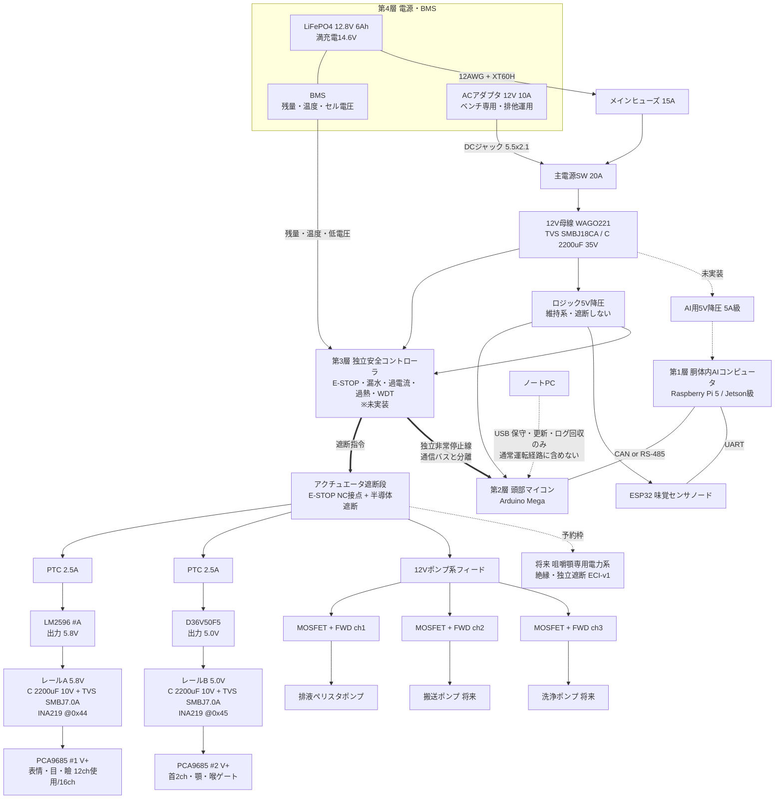

# 電源系統図 v1（頭部フェーズ／スケール100%）

対象: InMoov首・i2Head＋口内モジュール＋味覚ノード
準拠: `蓮冥頭部 H-Phase 0-24 改訂手順書`（2026-08-03改訂）H-Phase 2 成果物 `PowerBudget_v0` / `OnboardControl_Architecture_v0` に相当

採用スケール: **100%**（H-Phase 1 CALIBRATOR比較にて確定）
⚠ H-Phase 0のBlender空間予約は94%基準で作成されているため、100%採用に伴う再作成が必要。別課題として管理する。

---

## 0. 設計方針

1. **通常運転にノートPCとインターネットを含めない。** USB接続は開発・更新・ログ回収に限定する
2. **安全停止はAI・OS・通信バスから独立させる。** LLMに安全判断を委ねない
3. **アクチュエータ電源は遮断でき、ロジック電源は安全側で維持する。** 筋肉を殺し、頭を生かす
4. **GNDは全系統共通、＋側はレールで分離する**
5. 電源ソースはベンチ=ACアダプタ、自律=LiFePO4。**同時接続禁止**（v1は物理的排他運用）

## 1. 制御四層と電源の対応

| 層 | 実体 | 電源 | 故障時の原則 |
|---|---|---|---|
| 第1層 AIコンピュータ | 胴体内（Raspberry Pi 5 / Jetson級・未選定） | 12V→5V/5A級 ※未実装 | 安全停止を妨げず再起動。クラウド無しで最低限継続 |
| 第2層 頭部リアルタイムマイコン | Arduino Mega | 5V-LOGIC（維持系） | 通信断で新規動作禁止、中立または力解放 |
| 第3層 独立安全コントローラ | **別マイコン・未選定** | 5V-LOGIC（維持系） | AI/OSから独立して停止を保持。手動確認まで再始動禁止 |
| 第4層 電源・BMS | LiFePO4＋BMS | — | 低電圧時は新規動作を止め、ログ保全後に安全終了 |

**第3層は現状未実装。**v1では要求のみ定義し、実装はH-Phase 12で行う。それまでの暫定として、Megaが安全ロジックを兼務する（**兼務は共倒れのリスクを持つため、暫定であることを明記する**）。

---

## 2. 系統図

※GNDは母線・レールA/B・ポンプ系・全マイコン・AI機で共通結線。スターポイントは12V母線横のGND用WAGO。
※`==>` は安全系の遮断経路、`-.->` は未実装または予約枠。

## 3. 現況（v1着手時点）との差分

| 項目 | 目標構成 | 現況 | 解消するH-Phase |
|---|---|---|---|
| AIコンピュータ | 胴体内蔵 | ノートPCが代行 | H-Phase 13 |
| 独立安全コントローラ | 専用マイコン | Megaが兼務（暫定） | H-Phase 12 |
| ロジック電源 | 12V→5V降圧 | ノートPCのUSB給電 | H-Phase 13 |
| 通信 | CAN / RS-485 | USBシリアル + I²C | H-Phase 13 |
| BMS監視入力 | 安全系へ結線 | 未接続 | H-Phase 12 |
| 咀嚼顎専用電力系 | 予約枠のみ | 未実装 | H-Phase 20 |

**現況のまま通常運転を「完成」と呼ばない。**上表が全て解消された時点でH-Phase 13の完了ゲートを満たす。

---

## 4. レール定義

| レール | 電圧 | ソース | 供給先 | 保護 | 監視 | 遮断 |
|---|---|---|---|---|---|---|
| 12V-MAIN | 12〜14.6V | バッテリ or ACアダプタ | 各降圧・ポンプ系 | 15Aヒューズ／SMBJ18CA／2200µF 35V | BMS | 主電源SW |
| 12V-PUMP | 12V | 遮断段の下流 | ペリスタポンプ×3（MOSFET経由） | MOSFET＋フライバックダイオード＋ソフトタイマ | — | **安全系で遮断** |
| 6V-A | **5.8V設定** | LM2596 #A | PCA#1（micro級12ch） | PTC2.5A／SMBJ7.0A／2200µF 10V | INA219 @0x44 | **安全系で遮断** |
| 6V-B | **5.0V固定** | D36V50F5 | PCA#2（首・顎・喉ゲート） | 同上＋モジュール内蔵保護 | INA219 @0x45 | **安全系で遮断** |
| 5V-LOGIC | 5V | 12V→5V降圧（現況はUSB） | 各マイコン、PCA9685 VCC、検知系センサ | — | — | **遮断しない（維持系）** |
| （予約）JAW-PWR | 未定 | 12V-MAIN | 将来の咀嚼アクチュエータ | 絶縁・独立ヒューズ | 荷重・電流・温度 | **独立遮断** |

- レールAを5.8Vにするのは、MG90S級の定格上限6.0Vに対するマージン確保のため
- **レールBはD36V50F5（5V固定・5.5A）を採用。**逆電圧保護・過電流保護・過熱保護・ソフトスタートを内蔵するため、v0で未解決だった逆接保護をレールB区間に限り解消する
- **5V動作によるトルク低下（公称6V比で約2割減）は、首サーボ選定時にトルク計算で妥当性を検証すること**
- 5V-LOGICを遮断しない理由: 非常停止後もログ、状態機械、安全監視を保持するため

## 5. 電流予算（目安・実測で更新すること）

| 負荷 | 定常 | ピーク | 備考 |
|---|---|---|---|
| レールA：micro同時5軸まで | 〜1.0A | 〜1.6A | ソフトで同時駆動数を制限。LM2596実用2A枠内 |
| レールB：首1軸＋小角度 | 0.5〜1.5A | ストール時〜3A | D36V50F5（5.5A）で枠内 |
| 12Vポンプ | 0.3〜0.5A/台 | — | 製品定格を受領後に記入 |
| 5V-LOGIC | <0.3A | — | 各マイコン＋PCAロジック＋検知系 |
| AIコンピュータ（将来） | 〜1.5A@5V | 〜3A | Raspberry Pi 5想定。要専用降圧 |

**稼働時間の見積もり**: 76.8Wh ÷（12.8V × 1.6A）≒ 3.7時間。深放電回避（8割）と変換損失を引いて**実用2.5〜3時間**。AIコンピュータ搭載後は再計算すること。

## 6. 保護部品の配置

- **独立安全コントローラ（未実装）**: 12V母線から給電し、アクチュエータ遮断段を直接制御する。入力は物理E-STOP、漏水、過電流、過熱、通信ウォッチドッグ、BMS低電圧。**AI・OS・通信バスから独立し、手動確認まで再始動しない**
- **E-STOP（NC接点）**: 遮断段に直列。NC＝押していない時に導通。断線時も停止側へ倒れる（フェイルセーフ）。1NO接点は状態通知用に第2層・第3層へ分岐
- 設計根拠: MOSFETは導通したまま故障し得るため、ソフトウェアによるポンプ停止を非常停止の手段として信頼しない
- **フライバックダイオード**: 全ポンプのコイルと並列。MOSFETモジュール内蔵の有無を実機で確認し、無ければ追加する
- **メインヒューズ15A**: バッテリ＋極の直近。守るのは機器ではなく配線であり、守れるのは自分より下流だけ
- **TVS SMBJ18CA**: 12V母線のWAGOに1個（スタンドオフ18V＝平常最大14.6Vより上）
- **TVS SMBJ7.0A**: レールA/Bの各PCA V+直近に1個ずつ
- **PTC 2.5A**: 各降圧の入力側に直列。自己復帰するが反応は遅く、ICは守れない
- **2200µF/35V**: 12V母線、**2200µF/10V**: 各レールのPCA V+端子直近
- 逆接保護: レールB区間はD36V50F5内蔵で解消。**12V母線は未解決**（XT60Hの極性運用のみ）
- プリチャージ抵抗100Ω/2W: 総容量約6600µFでは突入が小さいため**未使用**。将来の大容量バンク用に保管

## 7. 立ち上げ／停止手順

**起動**
1. E-STOPを押し込んだ状態で主SW ON
2. BMS確認 → 安全コントローラ自己診断 → 第2層マイコン初期化
3. PCA9685初期化（**OE=HIGHのまま**＝出力禁止）
4. 全chに中立値を書き込む
5. OE=LOW → E-STOP解除

**停止**
6. **喉ゲートを閉位置へ駆動 → 完了確認**
7. E-STOP押下 → OE=HIGH → 主SW OFF

**待機**
- 一定時間動作要求が無ければ OE=HIGH としてサーボ保持電流を遮断する（省電力・発熱抑制）。復帰は OE=LOW → 目標角送信の順。**待機は状態機械の正式な状態として実装する**

**非常停止時**
- 第2層・第3層はログと状態を保持し、手動確認まで再始動しない

## 8. 配線規約

- 12V=赤（主幹12AWG／分岐20AWG）、6V=赤＋黄マーカ、GND=黒、安全系信号=橙
- バッテリ主幹=XT60H、ベンチ入力=5.5×2.1 DCジャック、分配=WAGO 221
- **デュポンジャンパに電源電流を流さない**（信号専用）。接触抵抗による発熱と間欠不良の原因になる
- サーボ電源はサーボ延長ケーブル＋WAGO＋ねじ端子のみ
- **安全系の非常停止線は通信バスと別経路・別コネクタとする**
- 圧着後は引張確認、露出部は熱収縮チューブ

## 9. H-Phase 2 完了ゲート対応

| 完了ゲート | 本文書での対応 | 状態 |
|---|---|---|
| 通常運転の依存関係図にノートPCとクラウドが含まれない | §2 系統図でノートPCを点線・保守用に限定 | **設計反映済／実装未** |
| USB接続は開発・更新・ログ回収だけと定義 | §2 注記、§3 差分表 | 反映済 |
| 将来咀嚼アクチュエータ用の絶縁・遮断可能な専用電力系を予約 | §2 予約枠、§4 JAW-PWR行 | 反映済 |
| 既存12Vサーボ系・ロジック系・センサー系の電力予算 | §5 | 反映済（実測待ち） |
| 頭部質量・重心の測定と将来顎の許容領域 | **未着手** | 別課題（servo_comparison.md 参照） |

---

## 10. 未決・買い足し

- [ ] **PCA9685 ×2（最優先で発注）**
- [ ] **D36V50F5 ×1（レールB用）**
- [ ] メインヒューズ＋ホルダの到着確認（届くまでバッテリ運用禁止、ベンチはACアダプタのみ）
- [ ] **MOSFETモジュールのフライバックダイオード内蔵確認。無ければ追加発注**
- [ ] **独立安全コントローラの選定**（別マイコン。要件は§6）— H-Phase 12
- [ ] **E-STOP時の頭部落下対策の方針決定。**サーボ電源遮断で首の保持力が消えるため、機械ストッパー／非可逆減速機構／首のみ段階的力抜き のいずれかを採る。頭部質量確定後に判断 — H-Phase 3完了ゲート
- [ ] **喉ゲートの非通電時挙動。**ばね等で非通電時に閉じる機構とするか、停止シーケンスで閉動作を保証するか — H-Phase 12
- [ ] BMSの監視信号を安全コントローラへ結線する方式
- [ ] 12V母線の逆接保護（理想ダイオード/FET）
- [ ] AC/バッテリ切替回路
- [ ] AIコンピュータ用5V/5A級降圧の追加と、ロジック給電のUSB離脱
- [ ] ペリスタポンプの定格電圧・電流を実測して§5を更新
- [ ] 排液ポンプのみ緊急時にも動作させる例外の是非。作るなら専用経路と根拠を明記

---

## 変更履歴

- **v1 2026-08-03** 改訂手順書へ準拠。制御四層と独立安全コントローラを追加、ロジック電源をノートPCから分離、BMSと将来顎専用電力系を追加、レールBをD36V50F5(5V固定)へ変更、PCA#1を12chへ修正、停止手順に喉ゲート閉を追加、頭部落下対策を未決へ明記。ファイル名からバージョンを除去
- v0.1 2026-07-29 E-STOPを12V母線直後へ移動しポンプ系を遮断下流へ。待機状態を定義
- v0 2026-07-28 初版
