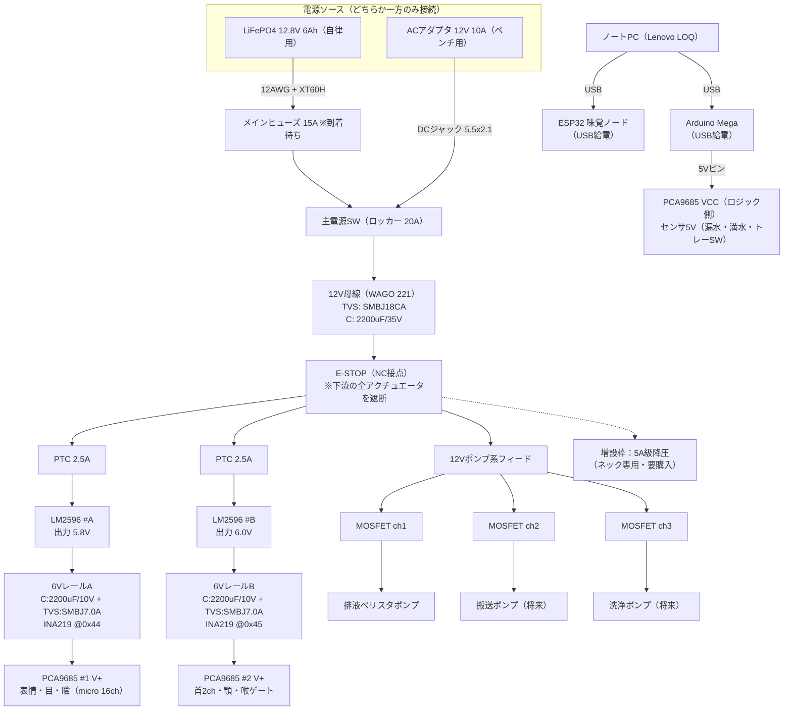

# 電源系統図 v0（頭部フェーズ／スケール100%）

対象: InMoov首・i2Head＋口内モジュール＋味覚ノード
方針: ベンチ=ACアダプタ12V10A、自律=LiFePO4 12.8V 6Ah（満充電14.6V）。**同時接続禁止**（v0は物理的に排他運用、切替回路はv1課題）。
ロジック（PC USB給電）とアクチュエータ電源（6V/12V）を分離。**GNDは全系統共通**。

---

## 系統図

※GNDは母線・レールA/B・ポンプ系・Mega・ESP32すべて共通に結線（スターポイントはWAGOの12V母線横にGND用WAGOを置く）。

---

## レール定義

| レール | 電圧 | ソース | 供給先 | 保護 | 監視 |
|---|---|---|---|---|---|
| 12V-MAIN | 12〜14.6V | バッテリ or ACアダプタ | 各降圧・ポンプ系 | 15Aヒューズ／SMBJ18CA／2200µF/35V | — |
| 12V-PUMP | 12V | MAIN直 | ペリスタポンプ×2（MOSFET経由） | MOSFETモジュール＋ソフトタイマ | — |
| 6V-A | **5.8V設定** | LM2596 #A | PCA#1（micro級16ch） | PTC2.5A（入力側）／SMBJ7.0A／2200µF/10V | INA219 @0x44 |
| 6V-B | 6.0V設定 | LM2596 #B →将来5A級 | PCA#2（首・顎・ゲート） | 同上 | INA219 @0x45 |
| 5V-LOGIC | 5V | Mega 5Vピン（USB由来） | PCA9685 VCC、漏水・満水・トレーSW | — | — |

- レールAを5.8Vにするのは、MG90S級の定格上限6Vに対するマージン確保のため。
- レールBは搭載サーボ確定後、HV対応品（〜6.8V級）なら6.5Vへの引き上げを検討。
- MegaはPC常時接続構成（AIライン必須）なのでUSB給電で確定。5VピンからPCAロジックとセンサへ分配（合計<0.3A想定）。

## 電流予算（目安・実測で更新すること）

| 負荷 | 定常 | ピーク | 備考 |
|---|---|---|---|
| レールA：micro同時5軸まで | 〜1.0A | 〜1.6A | **ソフトで同時駆動数を制限**。LM2596実用2A枠内 |
| レールB：首1軸＋小角度 | 0.5〜1.5A | ストール時〜3A | LM2596超過リスクあり。下記暫定ルール適用 |
| 12Vポンプ | 0.3〜0.5A/台 | — | 製品定格を受領後に記入 |
| 5Vロジック | <0.3A | — | PCAロジック＋センサ |

**レールB暫定ルール（5A級降圧の導入まで）**
1. 首は必ず単軸ずつ駆動（rotateとupDownを同時に動かさない）
2. 顎と首を同時駆動しない
3. INA219で2A超が2秒続いたら該当レールのサーボを停止（固定コード側）

## 保護部品の配置

- **メインヒューズ15A**: バッテリ＋極の直近（ホルダ到着待ち。届くまでバッテリ運用禁止、ベンチはACアダプタのみ）
- **TVS SMBJ18CA**: 12V母線のWAGOに1個
- **TVS SMBJ7.0A**: レールA/Bの各PCA V+直近に1個ずつ
- **PTC 2.5A**: 各LM2596の入力側に直列
- **2200µF/35V**: 12V母線、**2200µF/10V**: 各レールのPCA V+端子直近
- 逆接保護: v0はXT60Hの極性運用のみ（バッテリ側=メス等、向きを固定）。理想ダイオード/FET逆接保護はv1課題
- プリチャージ抵抗100Ω/2W: v0のコンデンサ容量（計約6600µF）では突入が小さいため**未使用**。将来の大容量バンク用に保管

## 立ち上げ／停止手順

1. E-STOPを押し込んだ状態（サーボ遮断）で主SW ON
2. PC接続 → Mega/ESP32起動 → PCA9685初期化（**OEピン=HIGHのまま**＝出力禁止）
3. 全chに90°ニュートラルを書き込んでから OE=LOW → E-STOP解除
4. 停止は逆順（E-STOP押下 → OE=HIGH → 主SW OFF）
5. 異常時はE-STOP即押し。ソフトはD18で押下を検知して状態遷移をHALT

## 配線規約

- 12V=赤（主幹12AWG／分岐20AWG）、6V=赤＋黄マーカ、GND=黒
- バッテリ主幹=XT60H、ベンチ入力=5.5×2.1 DCジャック、分配=WAGO 221
- **デュポンジャンパに電源電流を流さない**（信号専用）。サーボ電源はサーボ延長ケーブル＋WAGO＋ねじ端子のみ
- 圧着後は引張確認、露出部は熱収縮チューブ

## 未決・買い足し

- [ ] **PCA9685 ×2（在庫表に無い。最優先で発注）**
- [ ] 5A級降圧（XL4015等）×1 → ネック専用レールへ
- [ ] メインヒューズ＋ホルダの到着確認
- [ ] ペリスタポンプの定格電圧・電流を実測して表を更新
- [ ] 逆接保護方式（v1）
- [ ] AC/バッテリ切替回路（v1）

---
変更履歴: v0 2026-07-28 初版
